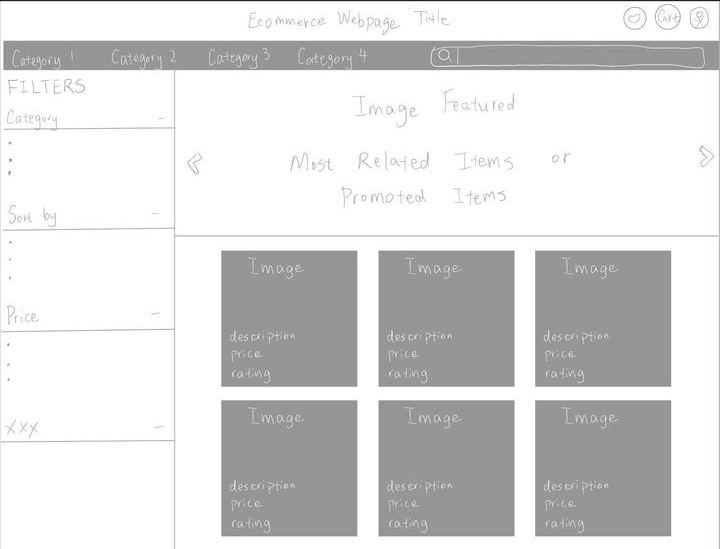
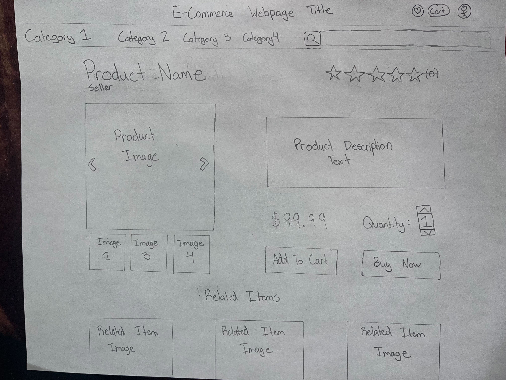

# About Our E-Commerce App
Discover the joy of online shopping with our user-friendly E-Commerce app. Browse products, add to wishlist or cart, breeze through checkout, and let admins effortlessly manage the store. Welcome to our app where shopping is a delightful enchantment for all.

## **Project Task Requirements**:

1.  **Minimal Requirements**

    a.  A dashboard with a search bar with product filters ✅

    b.  View selected product details ✅

    c.  Add product to shopping cart ✅

    d.  Products checkout page ✅

    e.  User Authentication with password assistance ✅

2.  **Standard Requirements**

    a.  User Account page ✅

    b.  View past orders ✅

    c.  Add products to wishlists ✅

    d.  An option to share products with friends ⚠️

    e.  Add product ratings ✅

    f.  Email notifications on product purchase ✅

4.  **Stretch Requirements**

    a.  Show user's recently viewed products ❌

    b.  Add reviews to a product/see past reviews ✅

    c.  An option to return an order ✅

    d.  Functionality to create seller/admin accounts ✅

    f.  Allow seller/admin to post, delete, and update products ✅

    
## Tech Stack

## Above and Beyond Functionality

## Next Steps
We have successfully fulfilled nearly all project requirements, with the exception of the 'Show Recently Viewed Products' feature, which remains pending, and the partially completed 'Share Products with Friends' functionality. Completing these two goals would further enhance the app's overall functionality.

During our discussions, we also explored additional potential features to enrich the shopping site's capabilities. These exciting prospects can add depth and sophistication to our platform, including
- Multi-language support for broader accessibility
- Implementing an advanced product recommendation algorithm personalized to each user
- Supporting different colors and sizes for each product
- Allowing actual payments and tracking for orders
- Introducing user roles to create separate pages exclusively accessible to sellers and buyers

## List of Contributions

## Project Group Information

- **Team** Team_undefined

- **Group Members:**
  
    - Arshdeep Jassi
  
    - Danielle Chen
  
    - Elsie Lee

    - Eshita Sharma

    - Florence Situ

- **Project Name**: E-Commerce-App
- **GitHub
Link:** [https://github.com/0804EshitaSharma/e-commerce-app](https://github.com/0804EshitaSharma/e-commerce-app)
- **Hosted Website Link 
Link:** [https://e-commerce-frontend-1ddb.onrender.com](https://github.com/0804EshitaSharma/e-commerce-app)

## **Project Description:**
Our project is an online store called E-Commerce-App, which is designed for customers to make online purchases, especially for those who are looking for convenience and favor 
online shops over traditional brick-and-mortar stores because of their comfort. It will store data such as product details and user information, so that the consumers can log in to their own accounts and have access to a variety of online purchasing features and services. It also supports the users to read descriptions, view photographs of the products, and check user reviews as they explore through comprehensive product lists. It includes products from a variety of categories, including electronics, apparel, household items, and more, which can be searched for by users. We are also considering functionalities such as creating the seller side of accounts and pages depending on the time constraints.

## Task Breakdown
The following are the two minimal requirements we have chosen to do task breakdowns for and their associated smaller tasks:

- A dashboard with a search bar with product filters

  - Create a search engine that has a side filter that lists categories like Electronics, Groceries, Shoes & Handbags, Luxury Beauty, etc. depending on the mock data.
  
  - Create a top area with a personalized horizontal scroll, and it should automatically show the best offers or show a few products to catch the user's eye.
  
- View selected product details

  - Decide how we want to store picture of product (as base64 string or blob storage or something else)
  
  - Display picture of product, description of product, price of product, quantity left
  
  - Create ‘Add to Cart’ button 

## Prototypes

These are our prototypes for the two requirements with task breakdowns mentioned above:

- the dashboard with search bar with product filters

- the view of the selected product details

